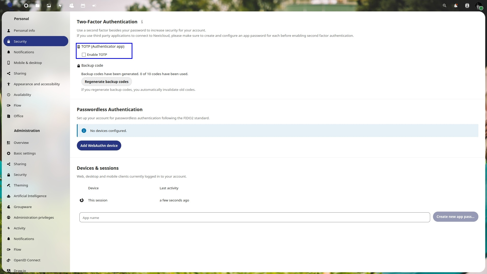
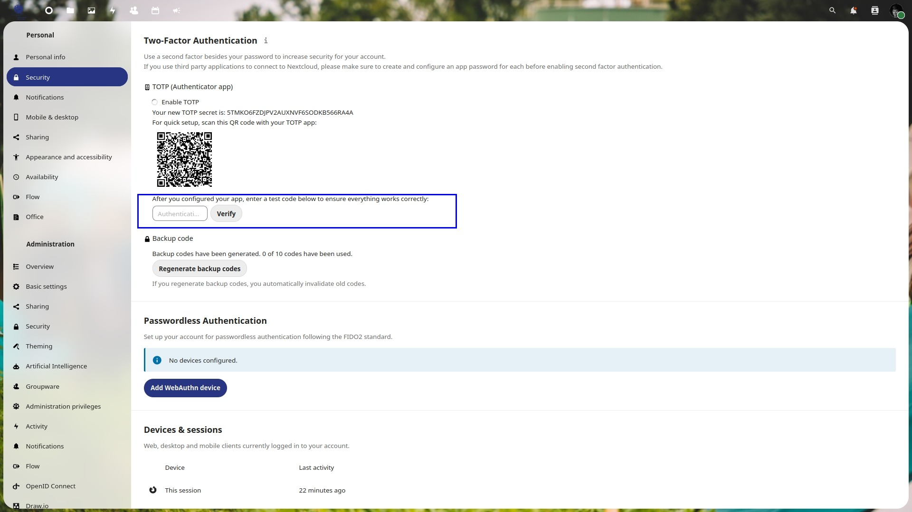
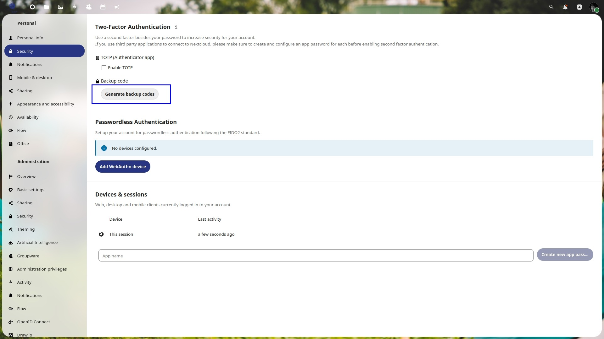
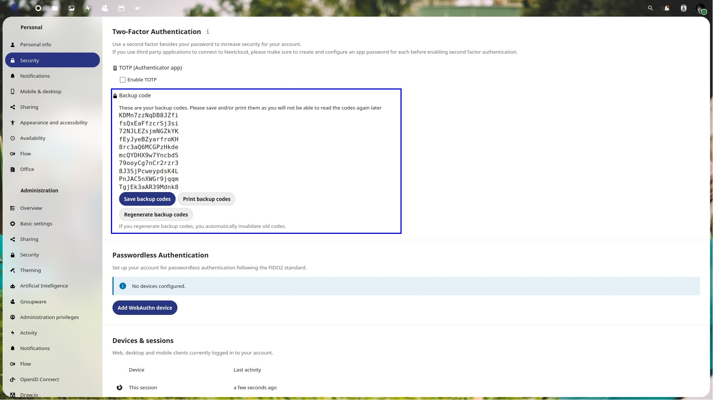

# Login

Für den ersten Login benötigst du das Administratoren-Login. Mit diesem kannst du wie im Kapitel 2 beschrieben, die Nextcloud für deine Schar konfigurieren. Es ist empfehlenswert, dass du zuerst das Design anpasst (siehe Kapitel 2.1) und dann die Authentifizierung mittels der Jubla.db aktivierst (siehe Kapitel 2.4).

## Adminbenutzer absichern mittels 2-Faktor-Authentifizierung (2FA)

Damit deine Nextcloud-Instanz sicher ist, muss der Adminbenutzer auch abgesichert sein. Als erstes, generiere Backupcodes. Diese kannst du verwenden, wenn du wegen dem Password oder der 2FA dich nicht mehr einloggen kannst. Speichere diese an einem sicheren Ort ab. Danach aktiviere wie in Bild 4 und 5 beschrieben die 2FA

<table class="step-table">
    <tr>
        <td>
            1
            
        </td>
        <td>
            2
            
        </td>
    </tr>
    <tr>
        <td>
            3
            
        </td>
        <td>
            4
            
        </td>
    </tr>
    <tr>
        <td>
            5
            
        </td>
        <td>Damit du allen Benutzern in der Gruppe „admin“ die 2FA erzwingen möchtest, gehe wie bei Kapitel 2.2.1 vor.</td>
    </tr>
</table>

