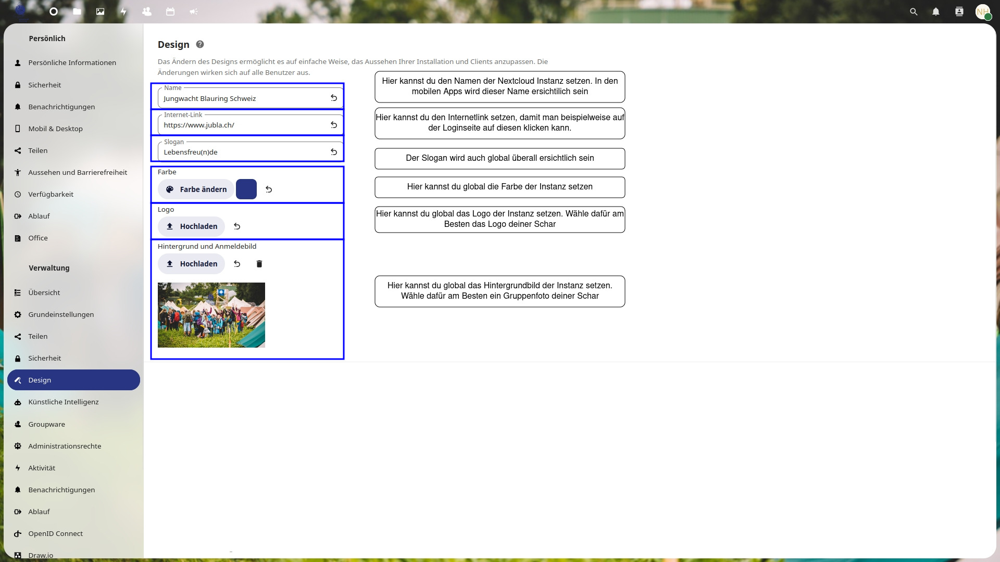
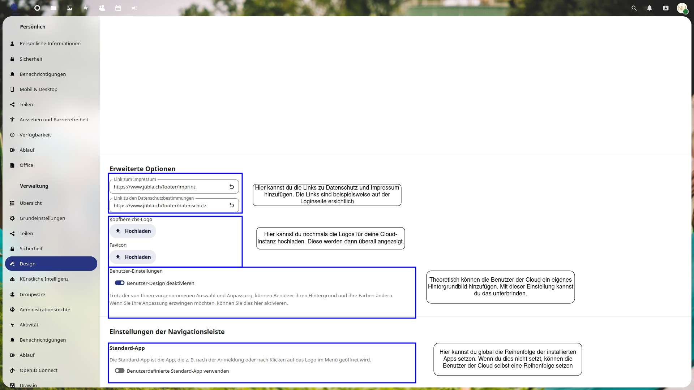

# Design ändern

In den Bildern ist erklärt, welche Einstellung für was ist.

## Name, Internet-Link, Slogan, Farbe, Logo, Hintergrund und Anmeldebild ändern

## Logo, Link zu Impressum und Datenschutzbestimmungen ändern

