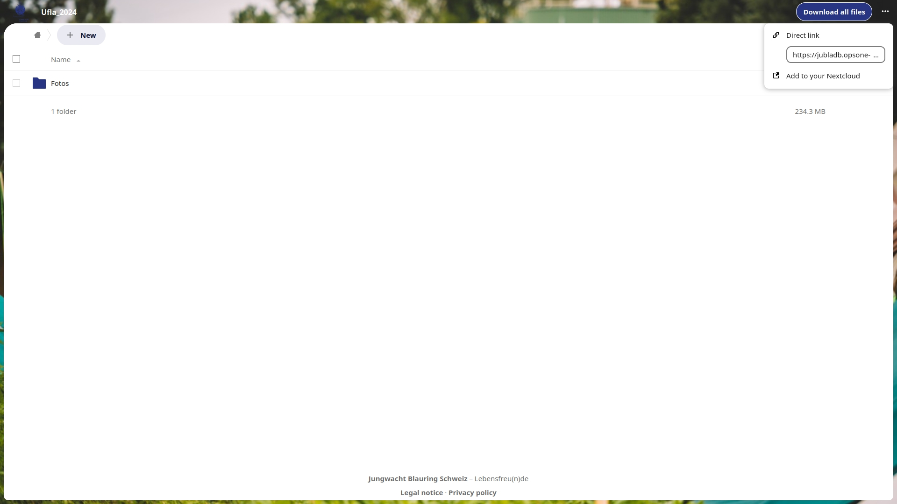
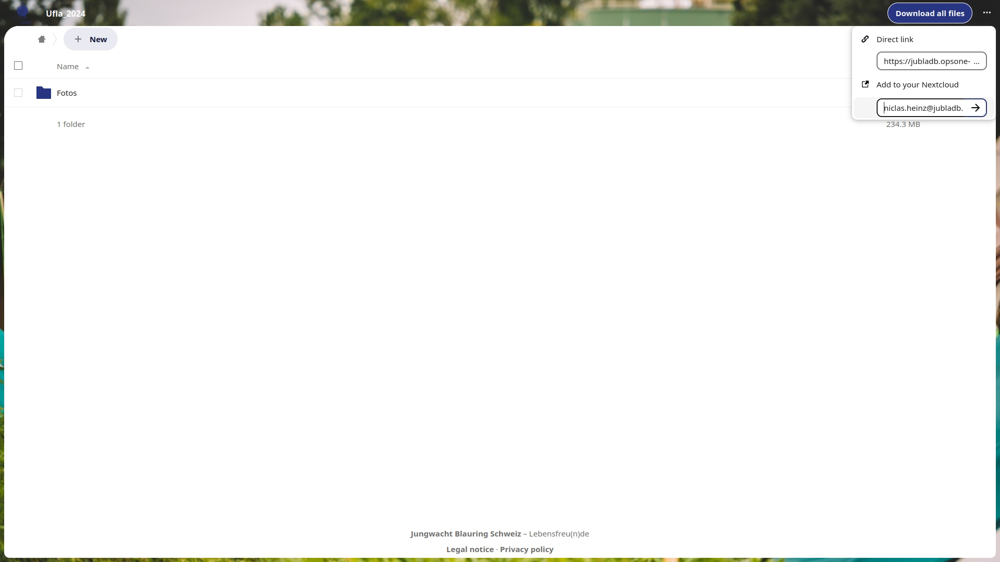
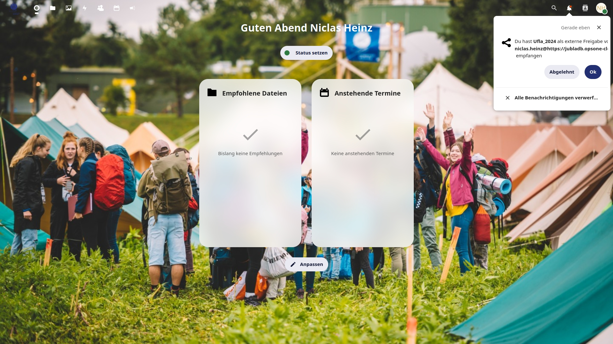
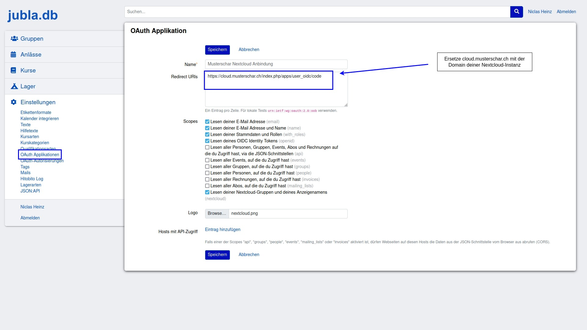
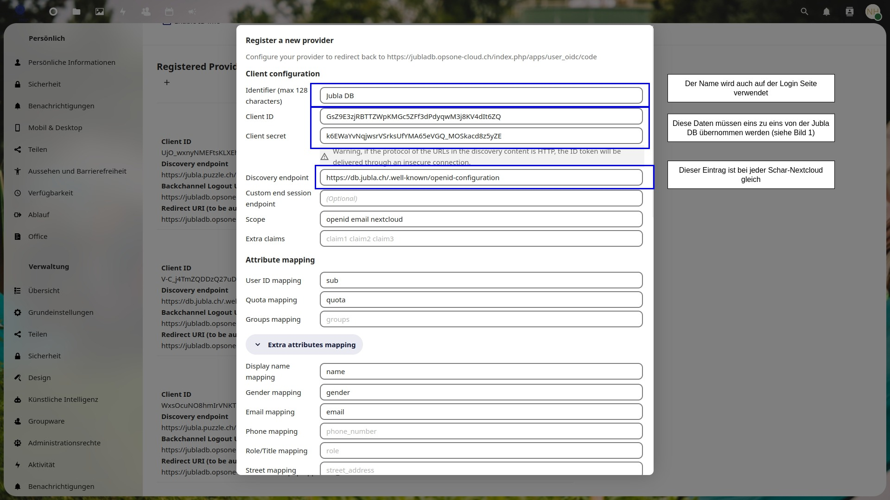
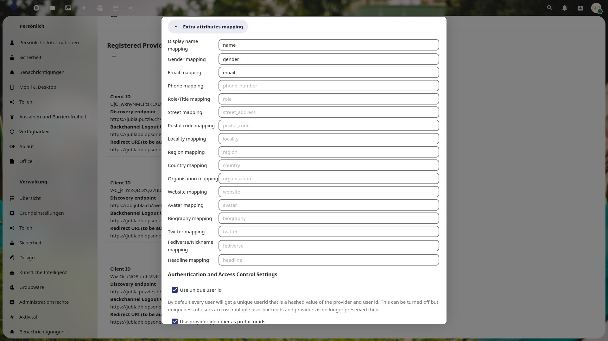
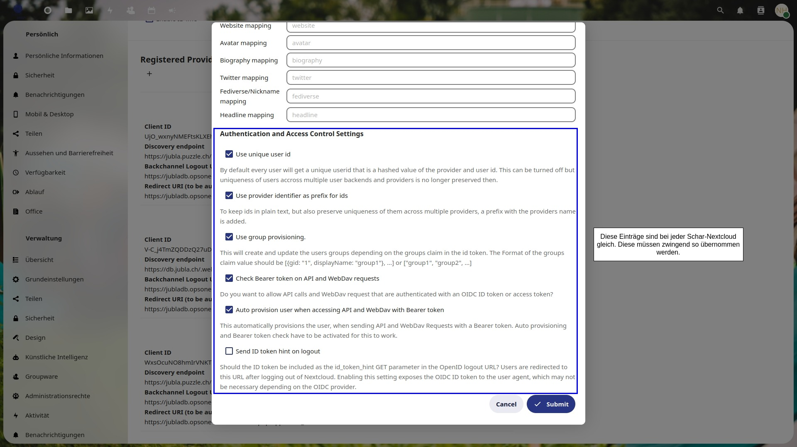
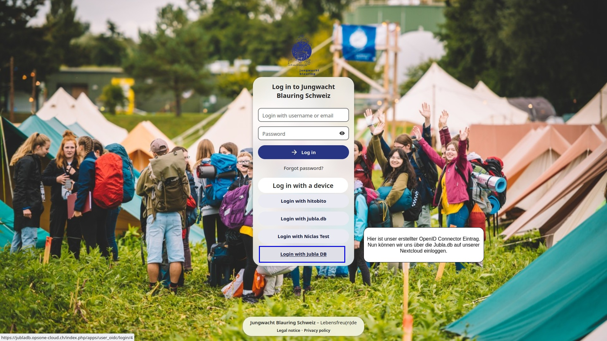
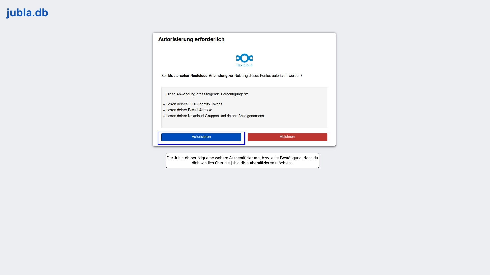
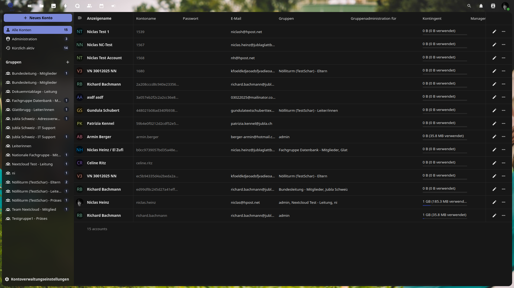

# Sicherheitseinstellungen

## Zwei-Faktor-Authentifizierung

Wir empfehlen, die zwei-Faktor-Authentifizierung für die Administratoren zu erzwingen. So hat man einen besseren Schutz. Man kann bei einzelnen Gruppen die zwei-Faktor-Authentizierung erzwingen.

## Serverseitige Verschlüsselung

Wir empfehlen die serverseitige Verschlüsselung zu aktivieren. Bei dieser werden alle Dateien verschlüsselt auf dem Server abgespeichert, jedoch kann die Instanz langsamer werden.

## Password-Regeln

Bei den Password-Regeln ist wichtig zu beachten, dass die Passwörter so stark sein müssen, damit man diese nicht so einfach errät. Das automatische ablaufen der Passwörter nach einer gewissen Zeit bietet eine erhöhte Sicherheit. Jedoch schadet dies der Bequemlichkeit. Hier muss der Administrator selbst überlegen, welche Einstellungen für ihn passen. Da die „normalen“ Benutzer der Schar gar kein Password eingeben müssen, betrifft dies nur die Administratoren-Benutzer.

## Einstellungen übers Teilen

### Virtueller Zaun um Nextcloud Instanz

Theoretisch kannst du einen „virtuellen Zaun“ um deine Schar-Cloud errichten. Dies kannst du bewerkstelligen indem du einstellst, dass nur Personen in der selbsten Gruppe sich gegenseitig sehen können. Zudem kannst du die „Federated Share-Funktion“ abstellen, damit niemand ausser deine Mitglieder auf die Instanz zugreifen können.

### Teilen mit anderen Schar-Nextcloud-Instanzen (Federated-Cloud-Sharing)

Wenn du mit einer anderen Schar Ordner oder Dokumente teilen möchtest, kannst du diese zwischen den Instanzen mittels der sogenannten Federated-Cloud-ID teilen. Die Federated-Cloud-ID kann unter [cloud.musterschar.ch/index.php/settings/user/sharing] abgerufen werden. Ausserdem kann man bei öffentlichen Freigaben 

<table class="step-table">
    <tr>
        <td>
            1
            
        </td>
        <td>
            2
            
        </td>
    </tr>
    <tr>
        <td>
            3
            
        </td>
    </tr>
</table>

## Authentifizierung mittels Jubla DB

Damit deine Scharmitglieder sich mittels der Jubla DB anmelden können, musst du zuerst die Authentifizierung einrichten. Die Benutzerrollen werden automatisch mitgeliefert. Verlässt jemand deine Schar, wird automatisch der Zugang zu der Instanz verwehrt. 

### Api Keys für Nextcloud-Authentifizierung erhalten

OAuth-Applikationen oder API-Keys (für Nextcloud) werden durch den Verband/FG Datenbank bereitgestellt (datenbank@jubla.ch). 
Mehr Informationen: https://jubladb-handbuch.readthedocs.io/de/latest/qa.html#oauth-applikationen.

## OpenID Connector konfigurieren

Wie Schritt für Schritt mittels den Bildern ersichtlich muss man zuerst auf der Jubla DB eine OAuth Applikation hinzufügen. Die Daten müssen dann in der OpenID Connector Sektion in den Nextcloud Administratoreneinstellungen übertragen werden. Und schon kann man diese Authentifizierungsmethode aktiv verwenden. Die Api-Keys werden, wie in 2.4.1 erklärt, von der Fachgruppe Datenbank erstellt und dem Verantwortlichen in der Schar gegeben. 

<table class="step-table">
    <tr>
        <td>
            1
            
        </td>
        <td>
            2
            
        </td>
    </tr>
    <tr>
        <td>
            3
            
        </td>
        <td>
            4
            
        </td>
    </tr>
    <tr>
        <td>
            5
            
        </td>
        <td>
            6
            
        </td>
    </tr>
</table>

## Benutzerverwaltung

Nachdem du die Authentifizierung mittels Jubla DB eingerichtet hast, musst du in der Regel keine Benutzer erstellen. Sobald ein Mitglied deiner Schar sich mittels der Jubla DB anmeldet, wird ein Benutzerkonto automatisch angelegt. Trotzdem ist es empfehlenswert ab und zu mal zu überprüfen, ob sich jemand eingeschlichen hat. Zudem solltest du als Administrator darauf achten, dass nicht zu viele Personen Administratorenrechte erhalten (ist aus Sicherheitsgründen wichtig). 

