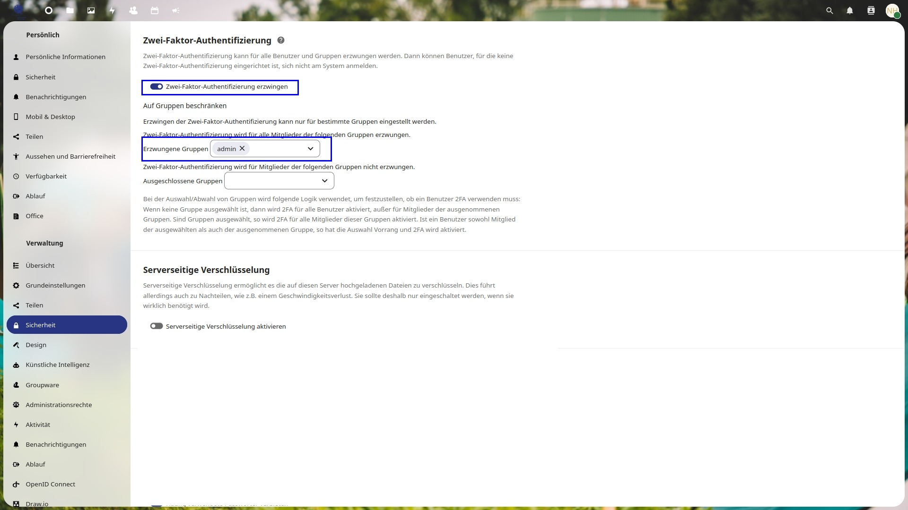

# Sicherheitseinstellungen

## Zwei-Faktor-Authentifizierung

Wir empfehlen, die zwei-Faktor-Authentifizierung für die Administratoren zu erzwingen. So hat man einen besseren Schutz. Man kann bei einzelnen Gruppen die zwei-Faktor-Authentizierung erzwingen.

## Serverseitige Verschlüsselung

Wir empfehlen die serverseitige Verschlüsselung zu aktivieren. Bei dieser werden alle Dateien verschlüsselt auf dem Server abgespeichert, jedoch kann die Instanz langsamer werden.

## Password-Regeln

Bei den Password-Regeln ist wichtig zu beachten, dass die Passwörter so stark sein müssen, damit man diese nicht so einfach errät. Das automatische ablaufen der Passwörter nach einer gewissen Zeit bietet eine erhöhte Sicherheit. Jedoch schadet dies der Bequemlichkeit. Hier muss der Administrator selbst überlegen, welche Einstellungen für ihn passen. Da die „normalen“ Benutzer der Schar gar kein Password eingeben müssen, betrifft dies nur die Administratoren-Benutzer.

## Einstellungen übers Teilen

### Virtueller Zaun um Nextcloud Instanz

Theoretisch kannst du einen „virtuellen Zaun“ um deine Schar-Cloud errichten. Dies kannst du bewerkstelligen indem du einstellst, dass nur Personen in der selbsten Gruppe sich gegenseitig sehen können. Zudem kannst du die „Federated Share-Funktion“ abstellen, damit niemand ausser deine Mitglieder auf die Instanz zugreifen können.